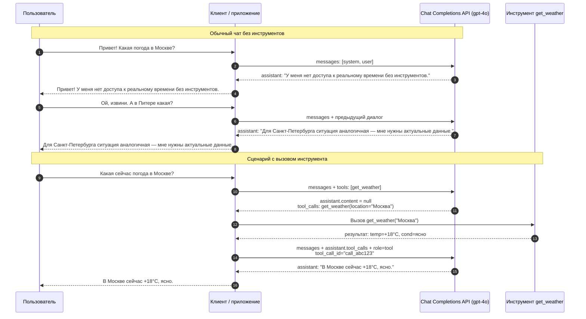

# Просто болтаем с моделью
## Запрос
```json
{
  "model": "gpt-4o",
  "messages": [
    { "role": "system", "content": "Ты — вежливый и лаконичный ИИ-ассистент." },
    { "role": "user", "content": "Привет! Какая погода в Москве?" },
    { "role": "assistant", "content": "Привет! У меня нет доступа к реальному времени без инструментов." },
    { "role": "user", "content": "Ой, извини. А в Питере какая?" }
  ]
}
```
## Ответ
```json
{ "role": "assistant", "content": "Для Санкт-Петербурга ситуация аналогичная — мне нужны актуальные данные." }
```
# Передаем запрос и описание инструмента
## Запрос
```json
{
  "model": "gpt-4o",
  "messages": [
    { "role": "system", "content": "Ты — лаконичный ассистент." },
    { "role": "user", "content": "Какая сейчас погода в Москве?" }
  ],
  "tools": [{
    "type": "function",
    "function": {
      "name": "get_weather",
      "description": "Получить текущую погоду в городе",
      "parameters": {
        "type": "object",
        "properties": { "location": { "type": "string" } },
        "required": ["location"]
      }
    }
  }]
}
```
## Ответ
```json
{ 
  "role": "assistant", 
  "content": null, 
  "tool_calls": [{ 
    "id": "call_abc123", 
    "type": "function", 
    "function": { "name": "get_weather", "arguments": "{\"location\":\"Москва\"}" } 
  }] 
}
```

# Передаем результат вызова инструмента
## Запрос
```json
{
  "model": "gpt-4o",
  "messages": [
    { "role": "system", "content": "Ты — лаконичный ассистент." },
    { "role": "user", "content": "Какая сейчас погода в Москве?" },
    { 
      "role": "assistant", "content": null, 
      "tool_calls": [{ 
        "id": "call_abc123", "type": "function", 
        "function": { "name": "get_weather", "arguments": "{\"location\":\"Москва\"}" } 
      }] 
    },
    { "role": "tool", "tool_call_id": "call_abc123", "content": "{\"temp\":\"+18°C\",\"cond\":\"ясно\"}" }
  ]
}
```
## Ответ
```json
{ "role": "assistant", "content": "В Москве сейчас +18°C, ясно." }
```

# Диаграмма взаимодействия

