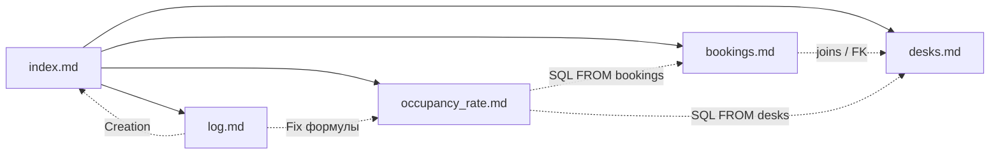

# coworking-bundle

Пример базы знаний в формате OKF (Open Knowledge Format) на примере домена коворкинга.

Каталог содержит пять Markdown-файлов: навигатор, две таблицы, одну метрику и журнал изменений. Каждый файл — самостоятельный «документ знания» с YAML-фронтматтером, который описывает его тип, назначение и связи с другими документами.

## Структура

| Файл | `type` | Назначение |
|---|---|---|
| [`index.md`](./index.md) | `Index` | Навигатор по базе знаний, корень графа ссылок |
| [`desks.md`](./desks.md) | `Table` | Реестр рабочих мест (справочник столов) |
| [`bookings.md`](./bookings.md) | `Table` | История аренды столов резидентами |
| [`occupancy_rate.md`](./occupancy_rate.md) | `Metric` | Формула расчёта процента занятых столов |
| [`log.md`](./log.md) | — | Хронология изменений базы знаний |

## Соглашения формата

Фронтматтер каждого файла описывает метаданные:

```yaml
---
type: Table          # Index | Table | Metric
title: Таблица бронирований (bookings)
description: Хранит сессии аренды столов резидентами.
status: stable       # draft | stable | deprecated
joins:               # необязательный блок связей
  - target: desks
    on: bookings.desk_id = desks.id
---
```

- `type` — роль документа в базе знаний, по нему выбирается способ использования.
- `status` — признак актуальности; устаревшие (`deprecated`) документы можно исключать из выдачи ассистенту.
- `joins` — машинно-читаемая связь между таблицами, аналог `FOREIGN KEY` в SQL.
- Тело файла — человекочитаемое описание: назначение, поля, формула.

## Как это используется

1. **Навигация.** `index.md` связывает документы Markdown-ссылками и служит точкой входа для ассистента.
2. **Разрешение связей.** По полю `joins` в `bookings.md` ассистент находит `desks.md`, чтобы развернуть `desk_id` в конкретный стол и его зону.
3. **Ответ на запрос.** На вопрос «какая сейчас загрузка?» ассистент открывает `occupancy_rate.md` и подставляет SQL-шаблон из тела файла.
4. **Актуальность.** Все изменения фиксируются в `log.md` с указанием файла и сути правки.

Пример цепочки для аналитического запроса:

```
"Какая загрузка в зоне Open Space?"
  index.md
    → occupancy_rate.md (метрика + SQL-шаблон)
    → desks.md          (поле zone_name для фильтра)
    → bookings.md       (поле desk_id и условия занятости)
```

## Граф связей

Пунктирные связи — ссылки в тексте, SQL и блоке `joins`; сплошные — Markdown-ссылки из `index.md`.



## Добавление нового документа

1. Создать файл с фронтматтером, где `type` соответствует назначению, а `status: draft`.
2. Описать содержимое в теле файла.
3. Добавить ссылку в `index.md` в раздел «Доступные концепты».
4. Зафиксировать правку в `log.md`.
5. Перевести `status` в `stable`, когда документ проверен.

## Ограничения примера

- `log.md` не имеет фронтматтера: журнал намеренно оставлен как обычный Markdown.
- связи из тела файлов (SQL, упоминания) не являются гиперссылками и не видны навигатору автоматически.
- Размер и схема подобраны для демонстрации, а не для реальной эксплуатации.
